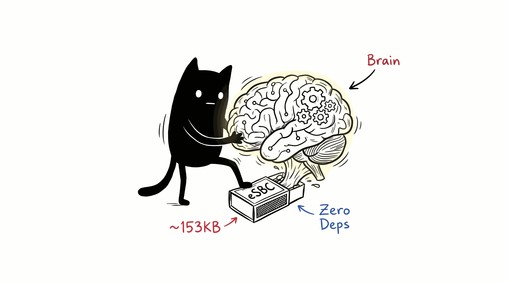
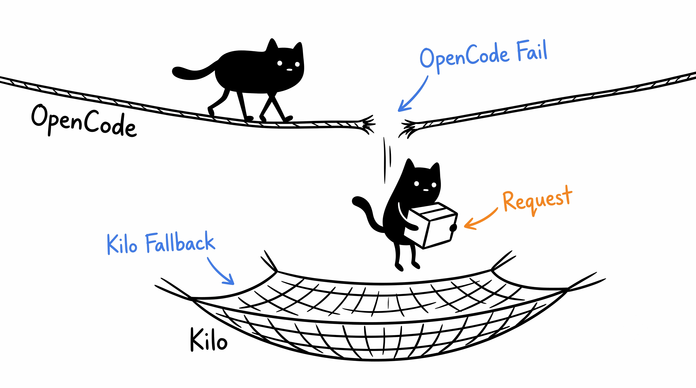
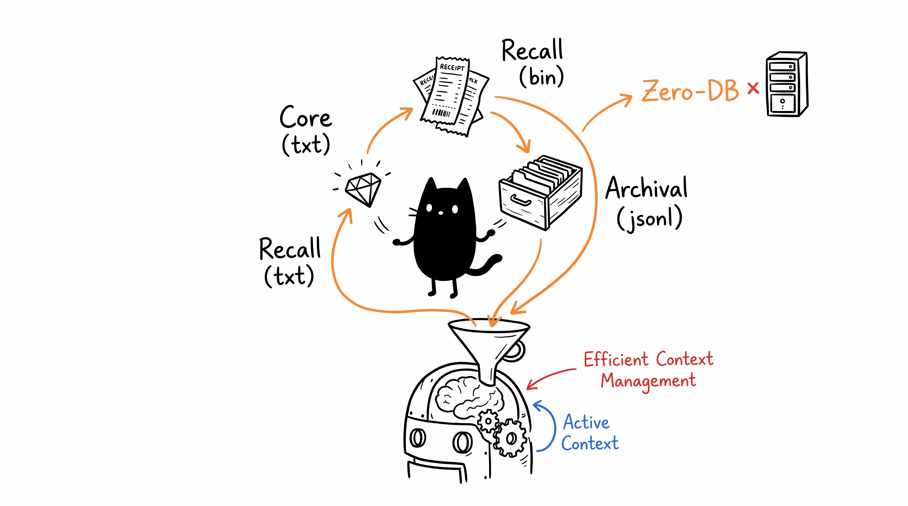

# T1a — Pure-C AI Agent for Embedded Devices

T1a is an ultra-lightweight AI agent built in C, designed to run one-per-device
on resource-constrained hardware. It is exclusively optimized for the **Luckfox Pico Mini RV1103**, serving as the ultimate "brain" for autonomous robots and zero-token smart appliances.
~153KB binary (~128KiB allocated), ~2MiB idle RAM, BearSSL only beyond libc.



## Key Features

- **OpenCode provider** — Free (`opencode.ai/zen/v1`), per-device rate limit.
  Main conversation model: `deepseek-v4-flash-free`.
- **Under-the-hood model** — `nemotron-3-ultra-free` handles tool-loop
  continuation and context-compaction summaries. The main model always writes
  user-visible final answers.
- **Cross-provider recovery** — Falls back to Kilo Gateway's `openrouter/free`
  when OpenCode fails or reaches its account-wide limit. No Kilo CLI required.
  Anonymous access needs no key; `KILO_API_KEY` is optional.

  
- **4 built-in MCP tools** — Reasoning (sequential thinking), web search (Tavily),
  encyclopedia (Wikipedia), persistent memory (Guardian). No Node.js required.
- **Tri-Partite Cognitive Memory (Zero-Dep)** —
  1. **Core Memory**: Editable facts injected into every prompt (`core_memory.txt`).
  2. **Recall Memory**: Short-term sliding window of 256 messages, saved efficiently to `chat.bin` to survive restarts, with auto-compaction and summarization.
  3. **Archival Memory**: JSONL-backed Guardian entity store for deep knowledge.

  
- **Telegram / CLI channels** — Long-poll for TG, interactive for CLI. Features a strict C-level Markdown-to-HTML translator for perfect Telegram message formatting without breaking JSON.
- **Native Hardware Control (Zero-Token Mode)** — Fully abstracted GPIO and I2C manipulation via Telegram `ReplyKeyboardMarkup` wizards. Interactive Menus allow creating component aliases (`LED`, `OLED`, `SERVO`) and bypassing the LLM completely for instant, free hardware actuation.
- **Autonomous Robot Mode (AI-Agent Mode)** — Hardware commands (`hw_gpio`, `hw_i2c`) are registered as native tools, allowing the AI to autonomously read sensor data (e.g. MPU6050 gyroscope) and write to GPIO pins to achieve complex robotics goals.
- **Caveman system prompt** — <200 token, keyword-driven.

## Architecture

```
src/main.c              Entry: agent / gateway / status / doctor
src/config.c            JSON config + ENV overrides → OpenCode endpoint
src/agent.c             Chat loop: push_msg → LLM → tools → response
src/provider.c          OpenAI-compatible OpenCode → Kilo provider chain
src/hardware.c          Core GPIO, I2C, and PWM abstraction + Alias mapping
src/hw_mpu6050.c        MPU6050 Accelerometer/Gyroscope I2C wrapper
src/hw_oled.c           OLED SSD1306 frame buffer & 5x7 font rendering
src/hw_dht.c            DHT11/DHT22 Kernel IIO integration
src/hw_buzzer.c         Passive buzzer PWM frequency controller
src/hw_r2d2.c           R2-D2 melody and voice generation engine
src/hw_servo.c          Standard RC servo (Pan/Tilt) PWM mapping
src/hw_directio.c       Explicit wrapper for free pins (F1-F5)
src/commands.c          Tool registration + Telegram Interactive Wizards
src/tools.c             13 built-in tools
src/mcp_builtin.c       reasoning + Tavily + Wikipedia + Guardian tools
src/mcp.c               External MCP client (optional)
src/memory.c            Guardian memory backend (JSONL persistence)
src/channel.c           Telegram long-poll + Inline keyboard injection
src/gateway.c           HTTP REST gateway
src/http.c              BearSSL native TLS (no libcurl, no OpenSSL)
src/json.c              JSON parser + writer
src/arena.c             Arena allocator
```

## Quick Start

Only the Telegram bot token is required. Tavily and Kilo keys are optional.

```bash
# Clone & build (interactive — asks for keys)
./build.sh

# Run as Telegram daemon (auto-restart on crash)
./run_t1a.sh

# One-shot via CLI
./t1a agent -m "Apa kabar?"

# Run diagnostics
./t1a doctor
```

## Systemd Service

```bash
cat > ~/.config/systemd/user/t1a.service <<EOF
[Unit]
Description=T1a AI Agent
After=network.target

[Service]
WorkingDirectory=$PWD
ExecStart=$PWD/run_t1a.sh
Restart=always
RestartSec=10

[Install]
WantedBy=default.target
EOF

systemctl --user daemon-reload
systemctl --user enable --now t1a.service
```

## Commands

| Command | Description |
|---------|-------------|
| `/status` | Unit health, tools, memory backend |
| `/reset` | Clear chat history |
| `/compact` | Remove the oldest 25% of context |
| `/restart` | Reboot T1a binary |
| `/gpio` | Opens interactive wizard to Write/Read/Map/Unmap GPIO pins natively |
| `/i2c` | Opens interactive wizard to Write/Read/Scan/Map I2C devices natively |
| `/help` | Command list |

## Philosophy

- **Zero external deps** — Pure C, BearSSL for TLS. No Python, Node.js, or SQLite.
- **Per-device scaling** — Each T1a appliance uses its own OpenCode free tier.
  No central API proxy or key bottleneck.
- **Efficiency first** — No wasted cycles, no unnecessary allocations.

---
*"Wong edan mah ajaib."*
